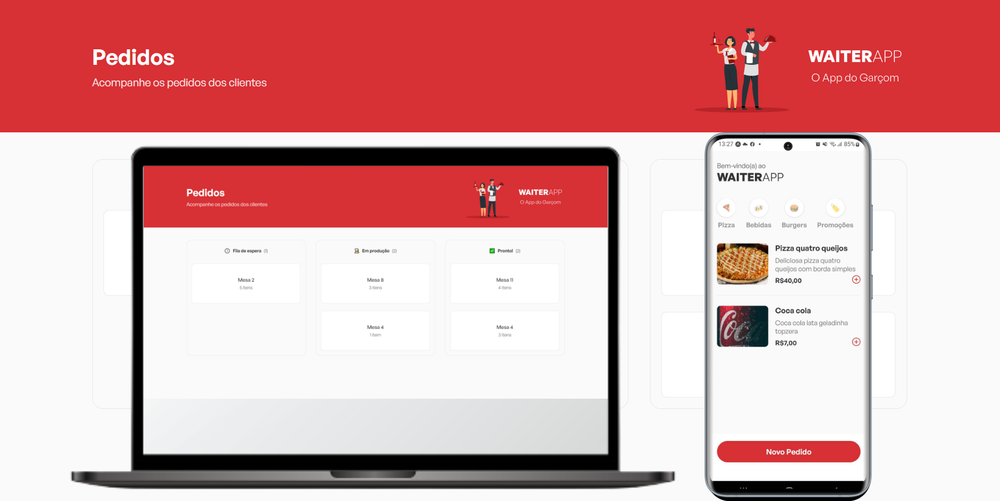
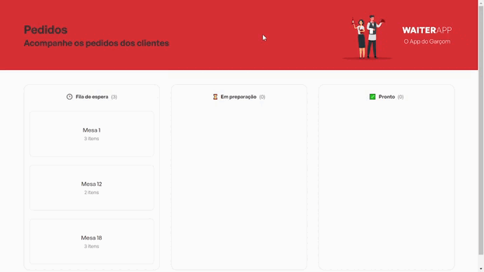

# Waiter App

  

<h2>Índice</h2>
<ol>
  <li><a href="#sobre">Sobre o projeto</a></li>
  <li><a href="#mobile">App mobile</a></li>
  <li><a href="#web">App web</a></li>
  <li><a href="#tecnologias-utilizadas">Tenologias utilizadas</a></li>
</ol>

# Sobre

  

No evento "O Poder do JavaScriot" do [/maateusilva](https://github.com/maateusilva/) desenvolvemos uma aplicação
web e mobile para gerenciamento de pedidos, voltada à garçons. O WaiterApp é 
uma alternativa para substituir as comandas em papel. Neste monorepo você encontra
os código da api desenvolvida com Node e MongoDb, o frontend desenvolvido com ReactJs
e o aplicativo desenvolvido com React Native.

O aplicativo é responsável pela apresentação do cardápio e criação de pedidos, enquanto a 
aplicação web exibe e gerencia os pedidos enviados pelo aplicativo. A experiência de atualização 
em tempo real ocorre através do uso de sockets que trasmitem instantâneamente a criação de novos 
pedido e demais funcionalidades, atualizando o conteúdo do aplicativo e site sem necessidade de
reload por parte do usuário.

# Mobile

  

<h3>Funcionalidades</h3>
<ul>
  <li>
Listagem de produtos
</li>
  <li>
Organização de produtos em categorias
</li>
  <li>
Detalhes dos produtos
</li>
  <li>
Carrinho de compras
</li>
</ul>

# Web

  

<h3>Funcionalidades</h3>
<ul>
  <li>
Listagem de pedidos
</li>
  <li>
Progresso dos pedidos
</li>
  <li>
Manipulação dos pedidos
</li>
</ul>

# Tecnologias utilizadas

- React 
- React Native 
- TypeScript 
- Expo
- Styled-Components
- socket.io <i class="devicon-socketio-original-wordmark"></i>
- ESlint

